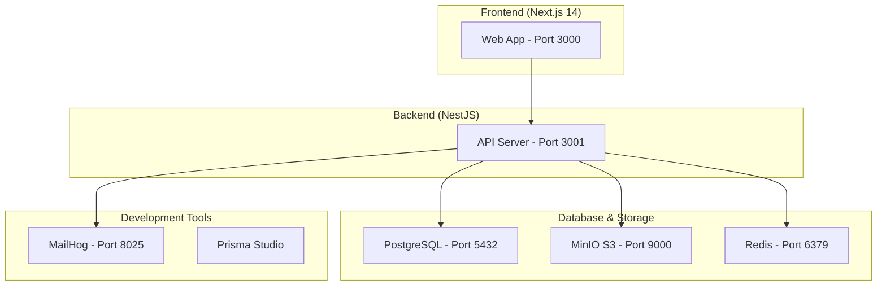

# Centrale UCL Manager

A production-ready full-stack TypeScript application for managing a student association (~150 members) with comprehensive features including member management, events with ticketing, payments, and GDPR compliance.

## 🏗️ Architecture

This is a **monorepo** built with modern TypeScript tooling:



### 📁 Project Structure

```
├── apps/
│   ├── web/          # Next.js 14 frontend (App Router)
│   └── api/          # NestJS backend with Prisma
├── packages/
│   ├── ui/           # Shared UI components (shadcn/ui)
│   ├── config/       # Shared configs (ESLint, Prettier, etc.)
│   └── schemas/      # Shared Zod schemas and types
├── docker-compose.yml # Development services
└── Makefile          # Common tasks
```

## 🚀 Quick Start

### Prerequisites

- **Node.js** 18+ and **pnpm** 8+
- **Docker** and **Docker Compose**

### Setup

```bash
# 1. Clone and install dependencies
git clone <repo-url>
cd GestionCentraleUCL
make install

# 2. Start development services
make docker-up

# 3. Set up database
make db-migrate
make db-seed

# 4. Start development servers
make dev
```

The application will be available at:
- 🌐 **Frontend**: http://localhost:3000
- 🔧 **API**: http://localhost:3001
- 📚 **API Docs**: http://localhost:3001/docs
- 📧 **MailHog**: http://localhost:8025
- 🗄️ **MinIO Console**: http://localhost:9001

## 🔧 Development

### Available Commands

```bash
make help              # Show all available commands
make dev               # Start development servers
make build             # Build all packages
make test              # Run tests
make lint              # Run linter
make typecheck         # TypeScript checking
make format            # Format code
```

### Environment Variables

Copy `.env.example` to `.env.local` and configure:

```bash
cp .env.example .env.local
# Edit .env.local with your configuration
```

## 🎯 Features

### Core Features
- 👥 **Member Management**: CRUD, roles, membership status
- 🎟️ **Events & Ticketing**: Event creation, ticket sales, QR check-in
- 💰 **Payments**: Stripe integration for dues and tickets
- 🧾 **Expense Management**: Submission and approval workflow
- 📧 **Communication**: Email campaigns with MJML templates
- 🏢 **Sponsor CRM**: Sponsor management and tracking
- 📦 **Inventory/Store**: Stock management and orders
- 📄 **Document Management**: File storage with access control
- 📊 **Analytics**: Dashboard with KPIs and statistics

### Security & Compliance
- 🔐 **RBAC**: Role-based access control
- 🛡️ **GDPR Compliance**: Data export, deletion, consent tracking
- 📝 **Audit Logging**: All actions tracked
- 🔒 **Secure Authentication**: NextAuth with magic links + OAuth

## 🧪 Testing

```bash
make test              # Unit tests
make test-e2e          # End-to-end tests
```

## 📱 Technology Stack

### Frontend
- **Next.js 14** (App Router, TypeScript)
- **TailwindCSS** + **shadcn/ui**
- **React Hook Form** + **Zod** validation
- **TanStack Query** for API state
- **Zustand** for client state
- **next-intl** for i18n

### Backend
- **NestJS** (TypeScript)
- **Prisma** ORM with PostgreSQL
- **OpenAPI/Swagger** documentation
- **Zod** validation schemas
- **Winston** logging

### Infrastructure
- **Docker** for development
- **GitHub Actions** CI/CD
- **MinIO** for file storage
- **Redis** for caching
- **Stripe** for payments

## 🔄 Database Schema

Key entities include:
- `User` - Member information and authentication
- `Membership` - Association membership status
- `UserRole` - Role-based permissions
- `Event` - Events with capacity and visibility
- `Ticket` - Event tickets with QR codes
- `Payment` - Stripe payment tracking
- `Expense` - Expense submission and approval
- `AuditLog` - Security and compliance tracking

See [`apps/api/prisma/schema.prisma`](apps/api/prisma/schema.prisma) for the complete schema.

## 📄 Documentation

- [API Documentation](http://localhost:3001/docs) - OpenAPI/Swagger
- [Security Policy](SECURITY.md) - Security policies and reporting
- [Privacy Policy](PRIVACY.md) - GDPR compliance and data handling
- [Contributing Guide](CONTRIBUTING.md) - Development workflow

## 🤝 Contributing

1. Fork the repository
2. Create a feature branch
3. Make your changes
4. Run tests and linting
5. Submit a pull request

See [CONTRIBUTING.md](CONTRIBUTING.md) for detailed guidelines.

## 📄 License

This project is private and proprietary to Centrale UCL.
